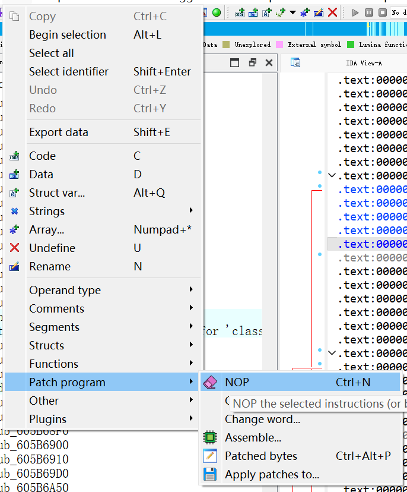
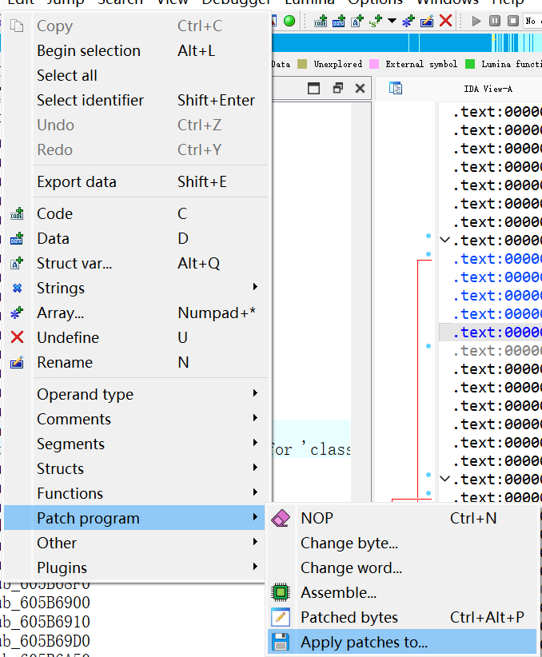

# Development

## Pre Decompiled Environment 

If you use the IDA database provided in this repository, please make sure your IDA Pro version is >= 8.3

## How to patch?

A screenshot is provided in the patch directory. Just NOP the selected content in the screenshot.

Then click "Apply patches to", select your binary file, and apply the patch

Last, Open binary with Hex editor, Replace `X-NLS-Signature` to lower-case `x-nls-signature`. See [gridd-unlock-patcher](https://git.collinwebdesigns.de/oscar.krause/gridd-unlock-patcher/-/blob/1.0/src/gridd-unlock-patcher.cpp#L241)